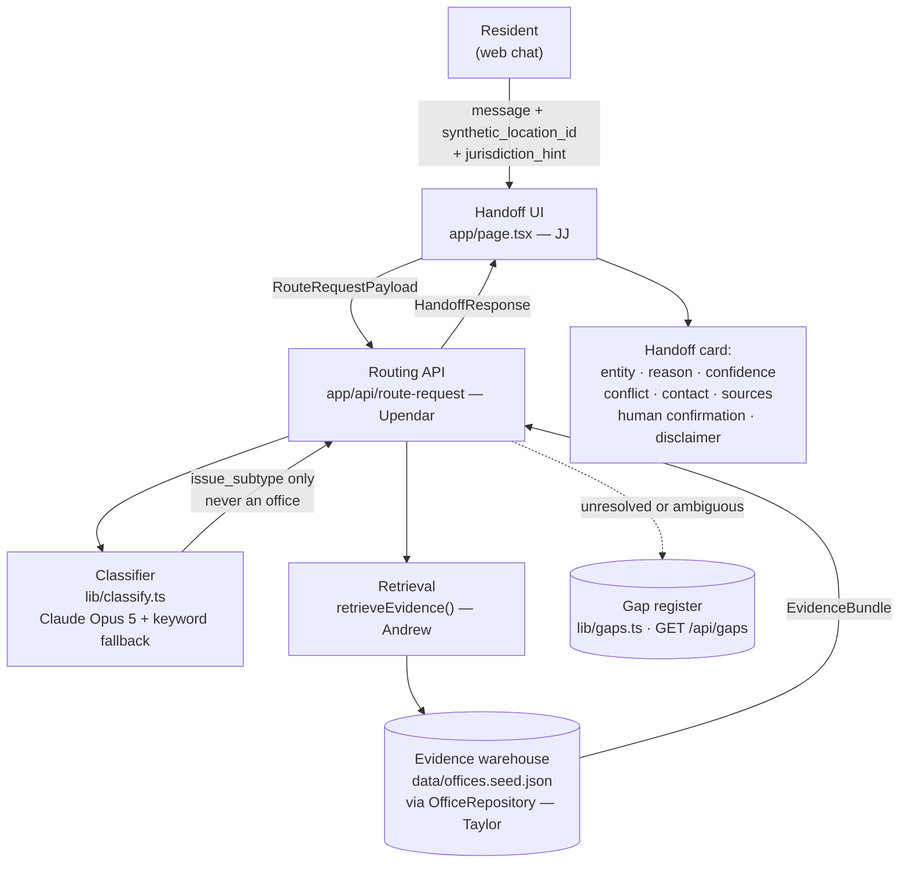

# CivicRoute BHM

**Birmingham Claude Impact Lab — Challenge 2: Make Regional Services Easier to Navigate**

> CivicRoute BHM turns a resident's plain-language public right-of-way problem and clearly
> synthetic location into a likely responsible city or county entity, the official evidence
> and contact channel behind that result, visible uncertainty, and a required
> human-confirmation step.

---

## The resident problem

A resident stands over a drain that backs up every hard rain. They call the city. The city
says it is county. They call the county. The county says it is city. They call the city
back, reach a different person, and hear county again.

Nobody on those calls is lying. Nobody on those calls actually knows.

Greater Birmingham is not one government. Jefferson County contains dozens of incorporated
municipalities, and the county and the state hold assets inside their borders. Three
structural facts make this unnavigable:

1. **A mailing address does not establish jurisdiction.** A Birmingham postal address does
   not mean you live inside Birmingham city limits.
2. **Responsibility is by asset, not by geography.** On one corner, the pavement, the drain
   beneath it, and the sidewalk beside it may have three different owners.
3. **Every jurisdiction publishes differently.** "Right-of-way maintenance," "street
   repair," and "public works request" may be the same thing or three different things.

The knowledge to answer "who owns this?" exists. It is simply never retained — every
resident and every frontline worker re-derives it from scratch, thousands of times a year.
This is not a knowledge gap. It is a **knowledge leak**.

---

## What the MVP does

- Accepts a plain-language description plus a **clearly synthetic demo location**.
- Classifies the problem into one of four right-of-way subtypes.
- Retrieves official evidence for the candidate jurisdictions.
- Returns a **handoff card**: likely responsible entity, the reason, confidence, any named
  conflict or gap, the official contact channel, cited sources with a checked date, and a
  required human-confirmation step.

## What the MVP does not do

- **It does not submit anything.** No tickets, no service requests, no referrals — live or
  synthetic. It routes a person; it does not act for them.
- **It does not decide legal responsibility.** It reports what public sources say and how
  confident it is. A public employee confirms.
- **It is not 311** and is not an official government service.
- **It does not take real addresses.** Only the three frozen synthetic demo locations.
- No SMS, voice, maps, accounts, advertising, analytics, live 311 integration, permits, or
  licensing. Those are roadmap items only.
- No personal data: no names, accounts, or case histories.

## Frozen scope

| | |
|---|---|
| **Interface** | Web chat only |
| **Service family** | `public-right-of-way-maintenance` |
| **Issue subtypes** | `pothole-road-damage` · `sidewalk-damage` · `blocked-drainage` · `fallen-tree-debris` |
| **Jurisdictions** | City of Birmingham (`birmingham-al`) · Jefferson County (`jefferson-county-al`) · City of Homewood (`homewood-al`) |
| **Locations** | `BHM-DEMO-01` · `BHM-DEMO-02` · `BHM-DEMO-03` — synthetic only |

All four subtypes have office records in all three jurisdictions. Anything outside this
grid returns `not_covered` and is written to the gap register, never guessed.

Scope is frozen for submission. Changes require sign-off from the product lead.

---

## Architecture



**The safety property that matters:** the language model classifies the problem and writes
narrative text. It **never** selects the responsible entity and **never** produces a phone
number. Contacts come only from the cited evidence warehouse. A hallucinated contact is
structurally impossible, not merely unlikely.

### Key modules

| Path | Role | Owner |
|---|---|---|
| [lib/contracts.ts](lib/contracts.ts) | **Frozen integration contracts.** Request, evidence bundle, handoff response, subtypes, sources, contacts, synthetic locations, mock. | Melina |
| [lib/types.ts](lib/types.ts) | Internal backend shapes for the current routing implementation | Backend |
| [lib/handoff.ts](lib/handoff.ts) | The frozen-contract boundary. The only place internals are translated to the contract. | Melina |
| [lib/classify.ts](lib/classify.ts) | Problem → subtype. Emergency short-circuit; keyword fallback when no API key | Upendar |
| [lib/repository.ts](lib/repository.ts) | `OfficeRepository` interface — the database swap point | Andrew |
| [lib/repositories/json-repository.ts](lib/repositories/json-repository.ts) | Fixture-backed implementation shipping today | Andrew |
| [lib/geocode.ts](lib/geocode.ts) | US Census jurisdiction resolution (see limitations) | Andrew |
| [lib/gaps.ts](lib/gaps.ts) | Gap register — the institutional byproduct | Backend |
| [data/offices.seed.json](data/offices.seed.json) | Office records with source URL and checked date | Taylor |
| [data/schema.md](data/schema.md) | Data contract for the warehouse | Taylor |
| [app/page.tsx](app/page.tsx) | Chat + handoff card | JJ |

---

## Setup

Requires **Node.js 20+** and npm.

```bash
git clone https://github.com/melinastafford15/birmingham-regional-service-navigator.git
```

```bash
cd birmingham-regional-service-navigator && npm install
```

### Environment variables

Copy [.env.example](.env.example) to `.env.local` and fill it in:

```bash
cp .env.example .env.local
```

| Variable | Required | Purpose |
|---|---|---|
| `ANTHROPIC_API_KEY` | No | Enables model-based classification. **Without it the app still runs** — classification falls back to deterministic keyword rules. |

`.env*` files are gitignored. No key is ever committed, logged, or sent to the browser —
the classifier runs server-side only.

### Commands

```bash
npm run dev
```

Then open <http://localhost:3000>.

| Command | What it does |
|---|---|
| `npm run dev` | Development server |
| `npm run build` | Production build — also the type check for the App Router |
| `npm start` | Serve the production build |
| `npm run lint` | ESLint |
| `npm run typecheck` | `tsc --noEmit` across the project |

> **Run `npm run build` (or `npm run dev`) before `npm run typecheck` on a fresh clone.**
> Next generates route types such as `LayoutProps` into `.next/types`, which is gitignored.
> Without them `typecheck` reports `Cannot find name 'LayoutProps'` in `app/layout.tsx`.
> The build itself type-checks, so `build` alone is sufficient verification.

> **There is no unit test suite yet.** Verification today is `build` + `lint` + `typecheck`
> plus the manual demo scenarios below. This is stated plainly rather than implied away.

---

## Data provenance and safety rules

Every office record carries a `source_url` and a `checked_on` date. The rules in
[data/schema.md](data/schema.md) are not optional:

1. **`is_synthetic: true` on every unverified row.** If a contact has not been verified
   against a real public page, it is synthetic and is marked and badged as such.
2. **Placeholder phone numbers use the reserved `555-01xx` range**, which cannot ring a real
   person. Plausible-looking invented numbers are never used.
3. **`source_url` and `checked_on` are required on real rows.** Provenance is displayed on
   every answer.
4. **Published public pages only.** No private, internal, or non-public contact information.
5. **Conflicts go in `notes` and are surfaced, not resolved.** If a city page and a county
   page disagree, the disagreement is the answer and confidence drops to `low`. Surfacing
   the disagreement is the product; picking a winner is not our call.

> ⚠️ **Current data state:** every row in `data/offices.seed.json` is `is_synthetic: true`
> with an `example.invalid` placeholder source, pending Taylor's verification pass. The
> demo is honest about this — synthetic records render with a visible example-data badge.

### Emergencies

Life-safety language (injury, fire, gas leak, downed power line) short-circuits **before**
any classification or lookup. The response is 911 and nothing else. This path needs no API
key and no network call.

---

## Fallback behavior

The demo does not depend on the network or on Claude being reachable.

| Failure | Behavior |
|---|---|
| No `ANTHROPIC_API_KEY` | Deterministic keyword classification. Response is marked `keyword_fallback`. |
| Claude API errors or times out | Same keyword fallback. The error is logged server-side; the resident still gets a routed answer. |
| Model returns unparseable output | Same keyword fallback. |
| Evidence lookup finds nothing | `not_covered` — says so plainly, guesses nothing, writes a gap-register entry. |
| Ambiguous ownership | Both claims are named, confidence drops, and a gap entry is written. |
| Emergency language | 911 short-circuit, before any dependency is touched. |
| Real address submitted | Refused with HTTP 400. The MVP accepts only the three synthetic demo locations. |

The rule: **degrade to a narrower honest answer, never to a confident wrong one.**

---

## Demo scenarios

All three locations are fabricated. No such addresses exist.

> **Current state, stated plainly:** all three cases **work today against the API** and
> were verified with no `ANTHROPIC_API_KEY` set, on the deterministic fallback path. They
> are **not yet runnable in a browser** — `app/page.tsx` is still framework boilerplate.
> Run them with the `curl` commands in [docs/API.md](docs/API.md), or build against
> `MOCK_BIRMINGHAM_SIDEWALK_RESPONSE`. Tracked in
> [docs/integration-checklist.md](docs/integration-checklist.md).

### 1. `BHM-DEMO-01` — Birmingham sidewalk

```json
{ "message": "The sidewalk is broken near my location",
  "synthetic_location_id": "BHM-DEMO-01",
  "jurisdiction_hint": "birmingham-al" }
```

Routes to **Birmingham Department of Transportation**, `medium` confidence, with a named
conflict: sidewalk repair may fall to the adjoining property owner. Shows the baseline card
— entity, reason, source, checked date, contact, confirmation step.

### 2. `BHM-DEMO-02` — Jefferson County drainage

```json
{ "message": "The drain at the corner is blocked and floods every hard rain",
  "synthetic_location_id": "BHM-DEMO-02",
  "jurisdiction_hint": "jefferson-county-al" }
```

A Birmingham-style mailing address that is **not inside any city**. Routes to
**Jefferson County Roads and Transportation**. This is the mailing-address trap — the
premise of the whole product, made visible.

### 3. `BHM-DEMO-03` — Homewood pothole

```json
{ "message": "There is a large pothole in the road",
  "synthetic_location_id": "BHM-DEMO-03",
  "jurisdiction_hint": "homewood-al" }
```

A separate municipality with its own intake. Shows that the same warehouse serves a third
jurisdiction, and that city/county claims can overlap on annexed streets.

Full walkthrough: [docs/demo-script.md](docs/demo-script.md).

---

## Known limitations

Stated plainly, because an honest demo is the goal.

1. **All contact data is synthetic.** Every row is a placeholder pending verification. No
   number in this repository reaches a real office.
2. **No automated test suite.** Verification is typecheck, lint, build, and manual scenarios.
3. **The gap register is in-memory.** It resets on redeploy. A durable store is roadmap.
4. **Three jurisdictions, four subtypes.** Everything outside that returns "not covered"
   rather than a guess.
5. **Synthetic locations only.** The MVP does not accept real resident addresses.
6. **Classification is not evaluated.** There is no scored accuracy number yet, and we do
   not claim one.
7. **No live status.** No queue position, no office hours, no promise anyone is open.
8. **No browser UI yet.** The API serves the frozen contract and all three cases work,
   but `app/page.tsx` is still framework boilerplate. This is the only thing between the
   current state and a running demo.

---

## 300-hour pilot roadmap

| Phase | Hours | Work |
|---|---|---|
| **1. Verify the data** | 60 | Replace every synthetic row with a verified official source and checked date. Build the re-verification cadence. |
| **2. Measure accuracy** | 40 | Human-reviewed answer key across the three jurisdictions; publish first-contact routing accuracy. |
| **3. Durable gap register** | 30 | Persist gaps; a review surface a regional body or mayor's office can actually read. |
| **4. Real address resolution** | 45 | Reintroduce Census jurisdiction lookup behind consent and a privacy review, so residents use their own address. |
| **5. Widen coverage** | 60 | More jurisdictions and more subtypes, gated on the accuracy metric holding. |
| **6. Second channel** | 40 | SMS pilot, once the web path is proven. |
| **7. Partner pilot** | 25 | One intake desk; measure misrouted-contact rate before and after. |

Sequencing principle: **verified data and a measured accuracy number come before any
widening of scope.** A wrong answer delivered through more channels is worse, not better.

---

## Team

| Person | GitHub | Lane | Branch |
|---|---|---|---|
| Melina Stafford | `melinastafford15` | Product lead, PM, integration, contracts, docs, submission | `docs/product-submit` |
| Andrew Parsons | `abparsons` | Warehouse and retrieval | `feat/warehouse-retrieval` |
| Taylor DeCelle | `tdecelle-ai` | Official evidence, normalized data, QA | `feat/evidence-qa` |
| JJ Foster | `joshuajfoster-rgb` | Frontend and handoff UI | `feat/handoff-ui` |
| Upendar | `Upendar11` | Claude RAG/API and safety | `feat/rag-api` |

Integration gates and PR order: [docs/integration-checklist.md](docs/integration-checklist.md).

---

## Human review point

CivicRoute BHM produces a recommendation and stops. The **public employee who answers the
phone is the person who confirms responsibility and acts.** No consequential decision is
made or executed by the system, and every routed card says so on its face:

> This is a navigation aid, not a legal determination, and it does not submit a service
> request.
